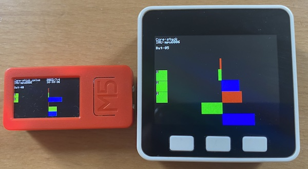

How to use
==========



This sample code is a port of the following example:
https://github.com/m5stack/M5Unified/blob/master/examples/Basic/HowToUse/HowToUse.ino

Installation
------------

- Compile and install AtomVM with `atomvm_m5` as explained [here](../../../README.md)
- Install rebar3
- Connect a M5 device with AtomVM (VM and library) preinstalled.
- Compile and flash with:

```
rebar3 esp32_flash -p /dev/tty.usbserial-*
```
