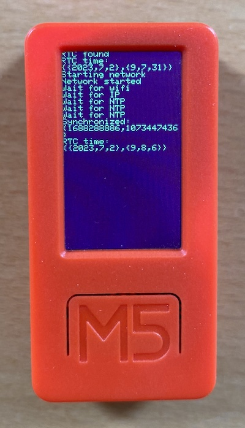

M5 RTC sample code
==================



This sample code illustrates how to use RTC and perform synchronization with NTP.

Usage
-----

- Install rebar3.
- Copy `src/config.hrl-template` to `src/config.hrl`
- Edit `src/config.hrl` with your Wifi credentials
- Connect a M5 device with AtomVM (VM and library) preinstalled.
- Compile and flash with:

```
rebar3 esp32_flash -p /dev/tty.usbserial-*
```
